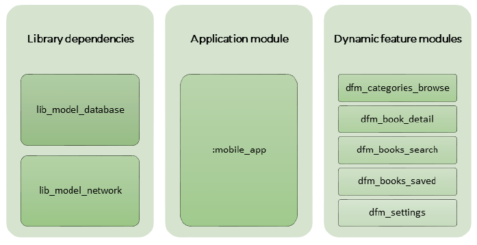
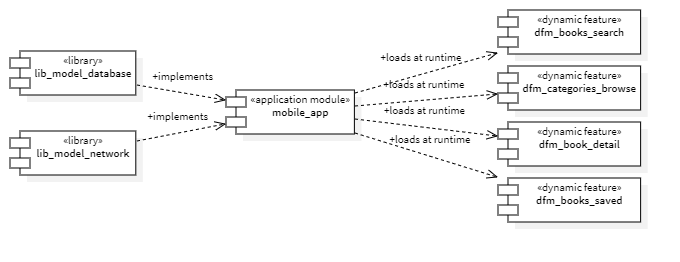

# Table of contents

- [Application features / modules](#application-features--modules)
  - [Library features](#library-features)
  - [Application features](#application-features)
    - [Features development status](#features-development-status)

# Application features / modules
Bookbar includes a set of modules that facilities the functionality of the application, the features.

1. List released books
2. Browse categories
3. List saved books
4. Book search
5. Show book detail

The features above are self-descriptive, and are organized in the following diagram, the module/library name are specified in the following sections of this document:

 *screens_organization as custom diagram*

As the application is using the [android app bundle](https://developer.android.com/guide/app-bundle) and [dynamic features](https://developer.android.com/guide/playcore/feature-delivery) specification for creating the android project and the modules, its clear that the app must be configured using app bundles and as such, the interaction between this features and the library dependencies are described as follows:

 *modules interaction as component diagram*

## Library features
Bookbar includes a set of libraries that facilities the network and database model and functionality.

| Component  | Library name        | Base package                                 | Designed | Developed | Unit tested | UI tested | 
|------------|---------------------|----------------------------------------------|----------|-----------|-------------|-----------|
| Database   | lib_model_database  | dev.marlonlom.apps.bookbar.model.database    | &#x2714; | &#x2714;  | &#x268A;    | &#x2714;  |
| Network    | lib_model_network   | dev.marlonlom.apps.bookbar.model.network     | &#x2714; | &#x2714;  | &#x2714;    | &#x268A;  | 

Where (&#x268A;) indicates that the item is not applicable, (&#x270E;) indicates that the item is in progress, and (&#x2714;) indicates that the item is in completed.

## Application features
Bookbar includes a set of features that explores and makes it good to explore a book store for checking IT books. 

### Features development status
The following shows a table with the defined features that contains the Bookbar android app. it will be updated across all states of the project.

| Feature                | Module name           | Base package                          | Designed | Developed | Unit tested | UI tested | Modularised |
|------------------------|-----------------------|---------------------------------------|----------|-----------|-------------|-----------|-------------|
| List released books    | mobile_app            | dev.marlonlom.apps.bookbar            | &#x2714; | &#x2714;  | &#x2714;    |           | &#x2714;    |
| Browse categories      | dfm_categories_browse | dev.marlonlom.apps.bookbar.categories | &#x2714; | &#x2714;  | &#x2714;    |           |             |
| Show book detail       | dfm_book_detail       | dev.marlonlom.apps.bookbar.detail     | &#x2714; | &#x2714;  | &#x270E;    |           |             |
| Book search            | dfm_books_search      | dev.marlonlom.apps.bookbar.search     | &#x2714; | &#x2714;  | &#x270E;    |           |             |
| List saved books       | dfm_books_saved       | dev.marlonlom.apps.bookbar.saved      | &#x2714; | &#x2714;  | &#x270E;    |           |             |
| Configure app settings | dfm_settings          | dev.marlonlom.apps.bookbar.settings   | &#x2714; | &#x2714;  | &#x268A;    |           | &#x268A;    |

Where (&#x268A;) indicates that the item is not applicable, (&#x270E;) indicates that the item is in progress, and (&#x2714;) indicates that the item is in completed.

 
