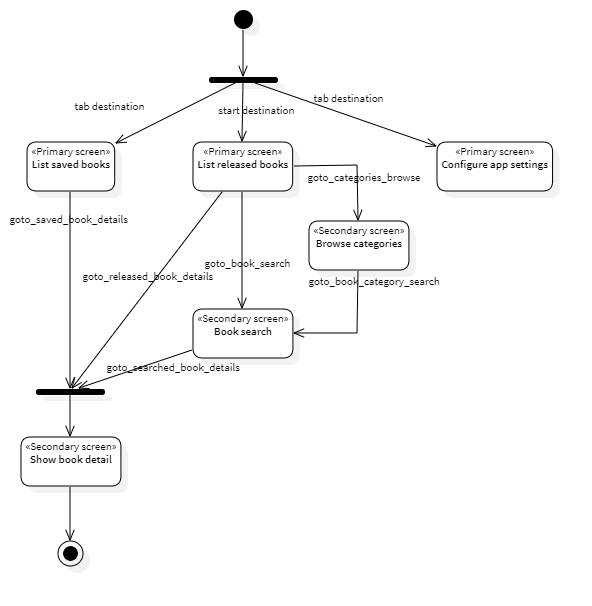
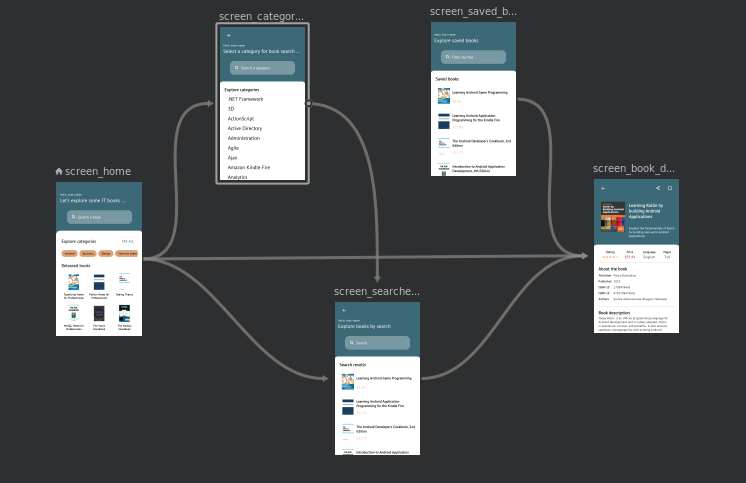

# Application navigation flows
Bookbar handles a common master-detail navigation pattern-like, which enforces the fetching flow of it books by searching using category names or text.

According to the screens defined, for each of them there is a navigation flow, which makes the application navigable in order to obtain information from IT books and thus provide a good user experience.

## Navigation design
The following table describes the navigation flows described before, identifying the source and target destinations and the correspondent actions.

| Navigation type | Destination          | Navigation action           | Target destination | Status    |
|-----------------|----------------------|-----------------------------|--------------------|-----------|
| Primary         | List released books  | goto_categories_browse      | Browse categories  | &#x2714;  |
| Primary         | List released books  | goto_book_search            | Book search        | &#x2714;  |
| Primary         | List released books  | goto_released_book_details  | Show book detail   | &#x2714;  |
| Secondary       | Browse categories    | goto_book_category_search   | Book search        | &#x2714;  |
| Secondary       | Book search          | goto_searched_book_details  | Show book detail   | &#x2714;  |
| Primary         | List saved books     | goto_saved_book_details     | Show book detail   | &#x2714;  |

Where (&#x270E;) indicates that the item is in progress, and (&#x2714;) indicates that the item is in completed. These navigation actions are implemented in the navigation graph.

Using the previous table, the following activity diagram is conceived, which describes a first visual of the connections between the application screens and the direction of each relationship or navigation action.

## Navigation implementation (navigation graph)

Bookbar uses the [Jetpack's Navigation component](https://developer.android.com/guide/navigation) for handling everything needed for in-app navigation.

Using the activity diagram, the navigation graph is created and it includes all of the content areas within the app, as well as the possible paths that a user can take through your app.

The navigation graph is located at the following location.

> [:mobile_app]/src/main/res/navigation/navigation_bookstore.xml

While using Android studio for editing the navigation resource file, you can see the screens/destinations and the connections between them, as describe in the following image.

 
