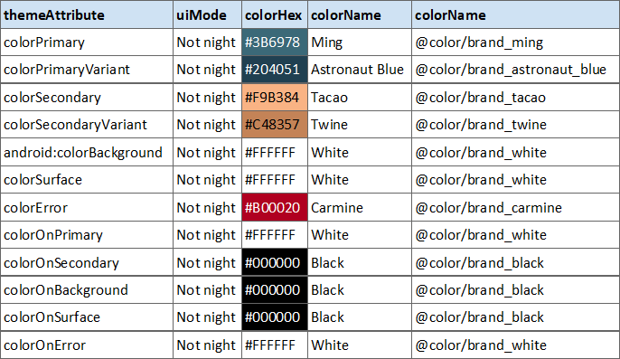
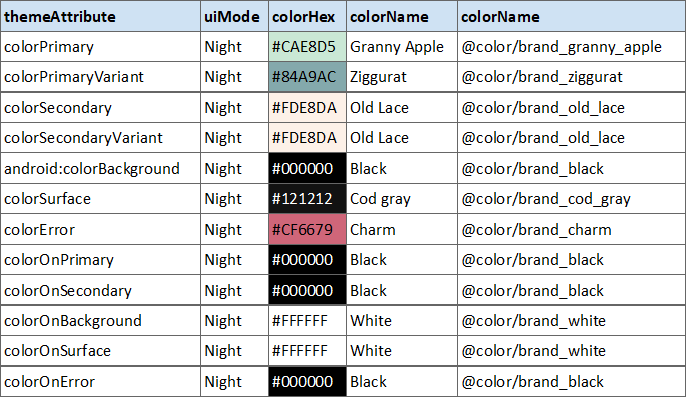
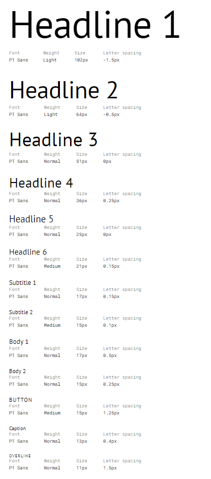

# Application theme
Bookbar is a book store app that uses Material Design components and Material Theming to create an on-brand and content-focused experience.

## About Bookbar
Bookbar allows users to browse IT books grouped by many categories and topics like technologies, programming languages, and more. It's brand and app are designed to be approachable, direct, and delightfully surprising.

## Product architecture
Bookbar’s information architecture is organized into a catalog-like structure. A catalog contains categorized information, the ui content is separated into main sections and subsections that are similar to those found in a book store, such as a category listing, a search screen and the saved books listing.

A catalog-like structure allows users to quickly navigate to an area of interest, but, with some organization in the main ui screen, for the exploring of the categories and the new releases of it books.

### Search
Bookbar has a simple search capability to quickly get readers to their desired book information. It appears in the screens that contains some listing information about boooks and its categories.

## Color
The color system supports 12 categories of color that can be applied to components, text, icons, and surfaces. The colors are choosen for the light theme and the dark theme as per Material theming specification, each one of the categories are detailed as per the theme colors for the Day (Non-night) and Night material theme, the following images describes each color.

 *Non-night theme colors*

 *Night theme colors*

## Typography

### Typefaces
Bookbar uses the [PT Sans](https://fonts.google.com/specimen/PT+Sans#about) font from [Google Fonts](https://fonts.google.com/about). This font is Designed by Alexandra Korolkova, Olga Umpeleva and Vladimir Yefimov and released by ParaType in 2009.

 *Bookbar Typeface*

#### PT Sans
PT Sans was developed for the project "Public Types of Russian Federation". PT Sans is based on Russian sans serif types of the second part of the 20th century, but at the same time has distinctive features of contemporary humanistic designs. The family consists of 8 styles: 4 basic styles, 2 captions styles for small sizes, and 2 narrows styles for economic type setting.

## Iconography
Bookbar uses the two-tone icons from [Material Icons](https://material.io/design/iconography/system-icons.html#icon-themes).

## Shape

* Small components
    - **Chips** have rounded corners with a 8dp corner radius.
* Medium components
    - **Cards** like shown in the screens for displaying detailed information (book search results, book details, etc.) have an overlay that include a top rounded corner with size of 20px and a bottom cut corner of 0px.

## Components

### Chips
Bookbar home screen contains action chips for a theme-based search experience. When a chip is tapped, it's navigated to the search book screen using the selected book category.

### Text fields (Search field)
Searching is the primary action on screens like home, category browse, saved books and the obviously named book search screen.
Bookbar uses scale to add emphasis to the search text field, also, a shaped rounded borders and a surface color with 50% transparency.

### Lists
Bookbar uses a customized list for its search results. This customized list provides generous white space around each list item and the variety of information each list item contains (such as book title and price, and photo). The white space allows the user to quickly scan results according to whichever information is most useful.
In Saved book screen, also contains  swipe to delete features, that allow to unsave the book.

 
